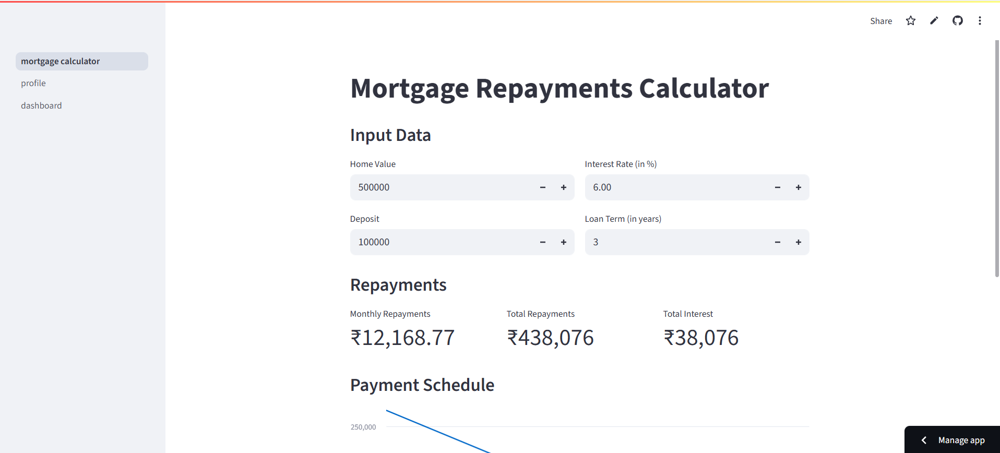

# Streamlit Demo App

 Mortgage Repayments Calculator
A simple and interactive web app built using Streamlit to help users calculate their monthly mortgage repayments. This tool is ideal for homeowners, real estate agents, and financial advisors who want quick insights into mortgage planning.

Features
🧮 Monthly Payment Calculation
Easily calculate monthly repayments based on loan amount, interest rate, and loan term.
🧑‍💻 User-Friendly Interface
Built with Streamlit, the app offers a clean, responsive, and interactive UI.
📈 Graphs & Insights
Optionally view interest vs. principal breakdown (if implemented in your version).

🙌 Acknowledgements
Streamlit Docs

Matplotlib

Mortgage EMI formula from standard financial mathematics

